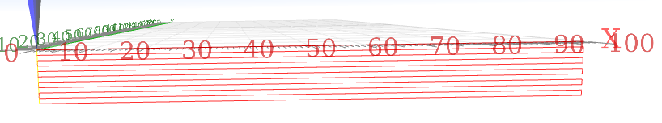
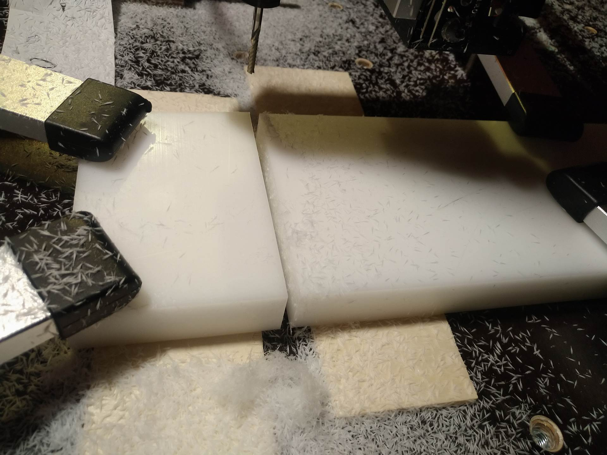

# Purpose
Simple macro for `OpenBuilds CONTROL` to mill a linear cut or pocket starting at 0/0/0.

# Installation
Copy the content of `src/ob-linear-cut-macro.js` and save it into a new macro within `OpenBuilds CONTROL`.

# Description
The purpose of this macro is to cut some stock by milling. It starts at 0/0/0 (x/y/z) and mills to x/y/z. In fact, depending on the placement of the stock relative to 0/0 and the x/y/z length, the macro can be used to
* cut a stock   
* mill a slot into a stock   
* mill a long-hole into a stock 
* mill a pocket into a stock   

The macro generates a sequence of G-Codes with linear milling movements in layers. The generated code will replace the one in the G-Code editor, and triggers the parsing and visualization of the code in the 3D viewer.

# Usage
When the macro is started it openes up a dialog window to enter the parameters:

## X/Y Movement
The milling operation is a linear movement from 0/0 to x/y (X/Y movement). 

## Cutting depth
Milling is being done from vertical 0 down to the cutting depth. Dependent on 0/0/0 and the thickness of your stock this results either in a pocket or a cut.

## Step-Down
The milling opereation will be done in vertial layers, starting at 0. The `step-down` defines the distance between the layers. If the `step-down` is larger than the hole deepth, it will be reduced to the deepth. The same is true if the remaining height of the last layer is less then the `step-down` height.

# Example
I needed two blocks of POM, one for a motor holder, one for holding two bearings. Each block should be 100x70x20mm (x/y/z). As stock I used a 100x500x20mm plate. To get parallel surfaces for the top and bottom, I performed the following steps:
* Using a 4mm endmill I want to trim the vertical front surface
* I used the macro to create a path to cut from 0/0/0 to 104/0/21 with a step-down of 21mm (i.e. just one path)
* I set the 0/0/0 to be close at the corner.
* I trimmed the surface and shifted the Y0 position in 0.1mm steps, until I got a clear surface.
* Next I shifted the Y0 position by 74mm (70mm + 4mm for the endmill)
* By using the macro I created a new path, as before, but with a step-down of 1mm.
* Executing the path results in cutting of my block.

The final result:

# Development
For the development I use `VS Code` running on linux. As the macros in `OpenBuild Control` are stored in an internal DB, you need to copy and paste your modified code into one macro.

## Testing
There is a testsuite based on `jest` to test if the generated g-code fits the expectations. The setup is based on `npm`. If you want to run the tests, you also need to install the development dependencies with `npm install`.

To run the tests themself, simply start `npm test`.

## Fixes 
Whenever you perform fixes, it is a good idea to start to add a test which should fail with the existing code. Next, fix the bug. Once the bug is fixed, your new / adjusted test should no longer fail.

## Enhncements
The same is true for enhancements. First add a test, let it fail, then add the code and let the test succeed.

